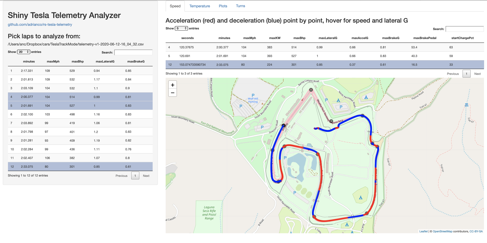
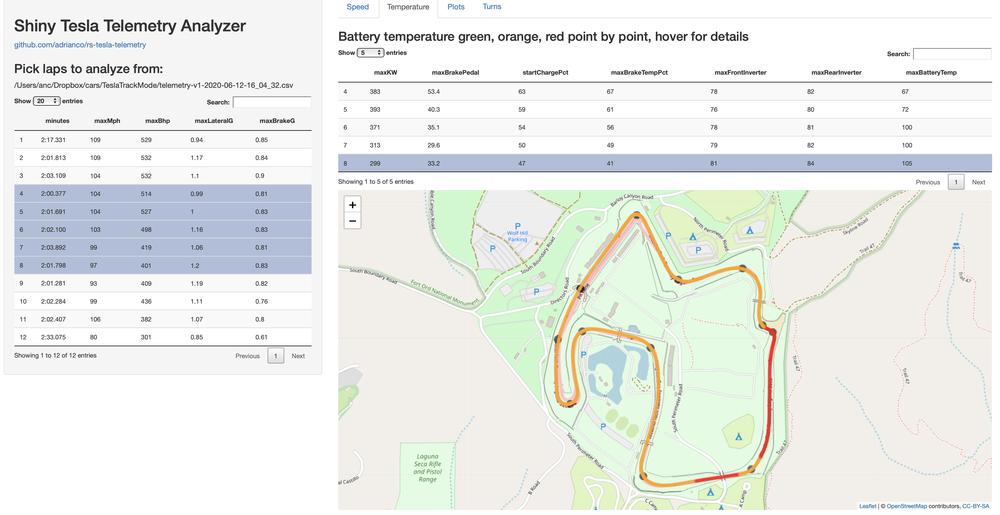
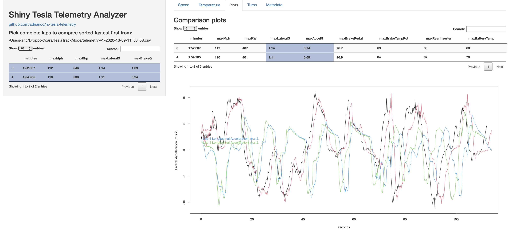
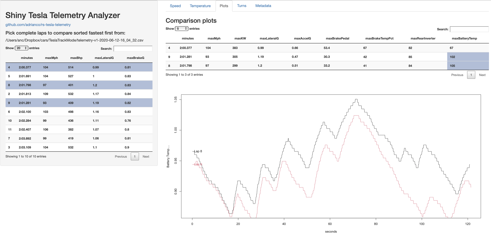

# rs-tesla-telemetry
RStudio Shiny viewer for Tesla Telemetry Track Mode files

Files are saved to the USB data logger port that is also used for Sentry videos. There's a silent video file of the track mode session, and a CSV format file named telemetry-v1-date-time.csv, there are 29 columns of data.

Running the app from RStudio, it first opens a file chooser, so the telemetry file needs to be on the same machine. After that is read it starts the user interface. This shows a summary of the performance data lap by lap, and a map view of the selected laps.

This is the header line for the csv
```
Lap,Elapsed Time (ms),Speed (MPH),Latitude (decimal),Longitude (decimal),Lateral Acceleration (m/s^2),Longitudinal Acceleration (m/s^2),Throttle Position (%),Brake Pressure (bar),Steering Angle (deg),Steering Angle Rate (deg/s),Yaw Rate (rad/s),Power Level (KW),State of Charge (%),Tire Pressure Front Left (bar),Tire Pressure Front Right (bar),Tire Pressure Rear Left (bar),Tire Pressure Rear Right (bar),Brake Temperature Front Left (% est.),Brake Temperature Front Right (% est.),Brake Temperature Rear Left (% est.),Brake Temperature Rear Right (% est.),Front Inverter Temp (%),Rear Inverter Temp (%),Battery Temp (%),Tire Slip Front Left (% est.),Tire Slip Front Right (% est.),Tire Slip Rear Left (% est.),Tire Slip Rear Right (% est.)
```

Here are the names after reading into R
```
> names(laps[[1]])
 [1] "Lap"                                   
 [2] "Elapsed.Time..ms."                     
 [3] "Speed..MPH."                           
 [4] "Latitude..decimal."                    
 [5] "Longitude..decimal."                   
 [6] "Lateral.Acceleration..m.s.2."          
 [7] "Longitudinal.Acceleration..m.s.2."     
 [8] "Throttle.Position...."                 
 [9] "Brake.Pressure..bar."                  
[10] "Steering.Angle..deg."                  
[11] "Steering.Angle.Rate..deg.s."           
[12] "Yaw.Rate..rad.s."                      
[13] "Power.Level..KW."                      
[14] "State.of.Charge...."                   
[15] "Tire.Pressure.Front.Left..bar."        
[16] "Tire.Pressure.Front.Right..bar."       
[17] "Tire.Pressure.Rear.Left..bar."         
[18] "Tire.Pressure.Rear.Right..bar."        
[19] "Brake.Temperature.Front.Left....est.." 
[20] "Brake.Temperature.Front.Right....est.."
[21] "Brake.Temperature.Rear.Left....est.."  
[22] "Brake.Temperature.Rear.Right....est.." 
[23] "Front.Inverter.Temp...."               
[24] "Rear.Inverter.Temp...."                
[25] "Battery.Temp...."                      
[26] "Tire.Slip.Front.Left....est.."         
[27] "Tire.Slip.Front.Right....est.."        
[28] "Tire.Slip.Rear.Left....est.."          
[29] "Tire.Slip.Rear.Right....est.."  
```
 
The app also persists a list of laps, with the structure shown above, that have been collapsed so that each GPS point has averaged data (6-10 points) to reduce the size, and a summary data frame lapdf as shown below.

```
> names(lapdf)
 [1] "num"              "seconds"          "minutes"          "maxMph"          
 [5] "maxKW"            "maxBhp"           "maxLateralG"      "maxAccelG"       
 [9] "maxBrakeG"        "maxBrakePedal"    "startChargePct"   "maxBrakeTempPct" 
[13] "maxFrontInverter" "maxRearInverter"  "maxBatteryTemp"  
 ```
 
 The code drops lap 0 (driving in the hot pit), splits the rest of the data into laps, filters out laps that don't start and end in the same place and cover the whole circuit, and calls plap on each to generate a row for each lap in the data frame, which is then sorted to have the fastest lap first. This is summarized in two tabs, one for speed and the other for temperature, and allows you to pick a lap to show on the map, and a plotting tab that lets you choose multiple laps and add more lines to the plot.
 
 
 
 
 
 
 
 
 
 
 
