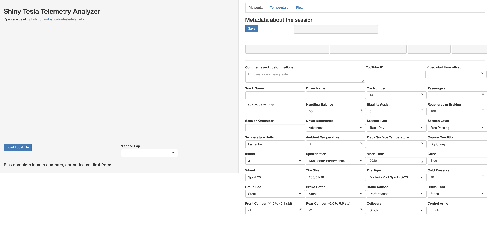

# rs-tesla-telemetry
RStudio Shiny viewer for Tesla Telemetry Track Mode files - personal spare time project.

Files are saved to the USB data logger port that is also used for Sentry videos. There's a silent video file of the track mode session, and a CSV format file named telemetry-v1-date-time.csv, there are 29 columns of data. Some people modify telemetry files to make the timestamp cumulative for import into tools that render data over the video files, and add columns for brake pressure in Lbs as well as Bar. If 33 columns are detected the app assumes that the file is in render format and deals with it. Files can also be saved in render format.

Running the app, the telemetry file needs to be on the same machine, specified on the command line or loaded from a chooser popup. Different files can be loaded without restarting the app, and it remembers where files were last loaded even across restarts. The app removes incomplete laps, sorts laps by fastest lap time, shows a summary of the performance data lap by lap, and summary tabs with a map view of the selected laps, and comparison plots of selected metrics vs. distance (rather than time, to align better). Plots can be zoomed in and out. Metadata about the session can be entered, and can be saved to a metadata file named and located the same as the telemetry file, which is loaded if it exists at startup. For each session, turn locations can be specified and compared across laps. If a video of the session is available on Youtube, it can be saved as part of the metadata along with an offset to align it with the telemetry file. The video will be started at the right point to show the lap or the turn, for easy comparisons.

For now the easiest way to run the app is by using RStudio to load it from github, and run it. It has been tested on both Mac and Windows. Some work to try and package it as a standalone app has run into packaging bugs.

To run the app from the command line without RStudio give the track file path like this:
```
% Rscript app.R /Users/anc/Dropbox/cars/TeslaTrackMode/telemetry-v1-2020-10-09-11_56_58.csv
...
Listening on http://127.0.0.1:6344
```
Then navigate to the URL and port shown on your machine using a web browser. Use ^C to stop the Rscript server.
If anything goes wrong, a log of the execution is written to app.Rout.

On MacOS, you can use `$ zsh runme.zsh /Users/anc/Dropbox/cars/TeslaTrackMode/telemetry-v1-2020-10-09-11_56_58.csv` which will open the browser for you.

See the [wiki for documentation](https://github.com/adrianco/rs-tesla-telemetry/wiki/Documentation) on how the code works and how to modify and extend it. 
 
When the app starts it has a blank display, hit the Load Local File button to get the file chooser.


Enter metadata about the session, and a YouTube ID if you have one.

 
See how the laps compare and whether the car has overheated during the lap

 
Plot comparisons between laps, and see video of turns

 
 
