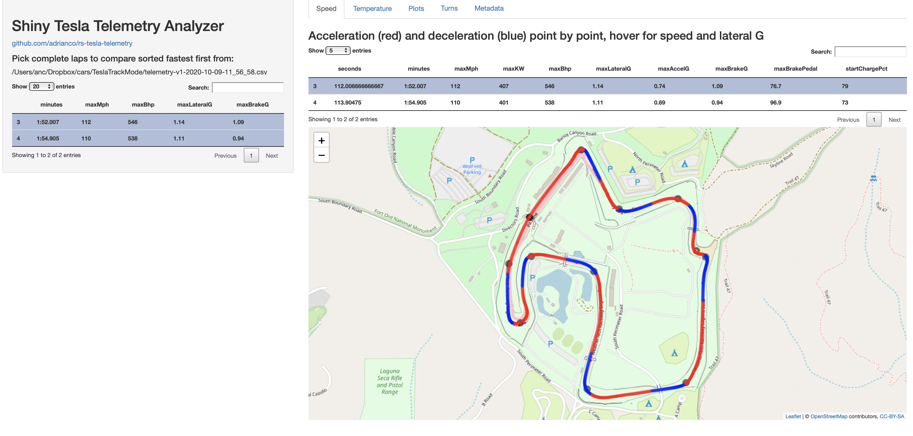
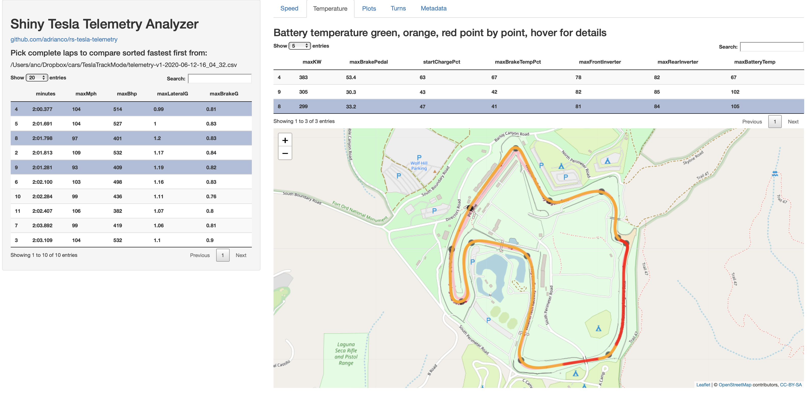
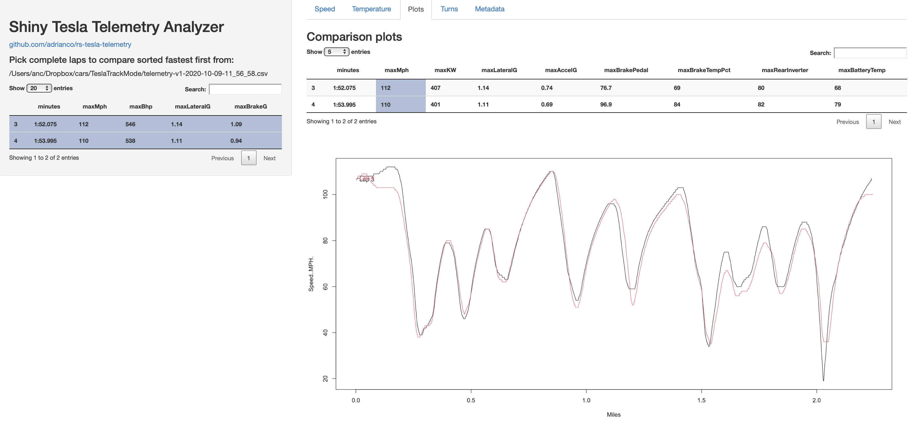
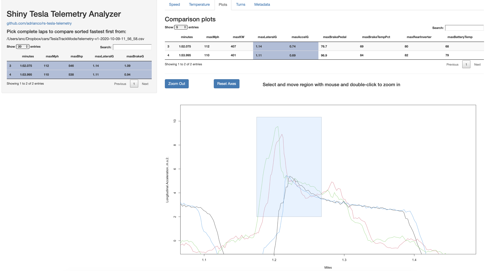
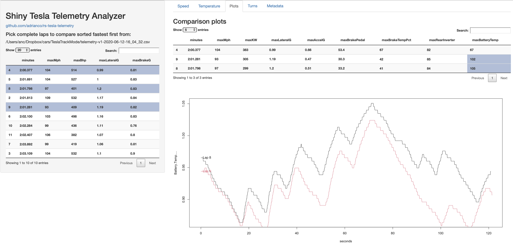
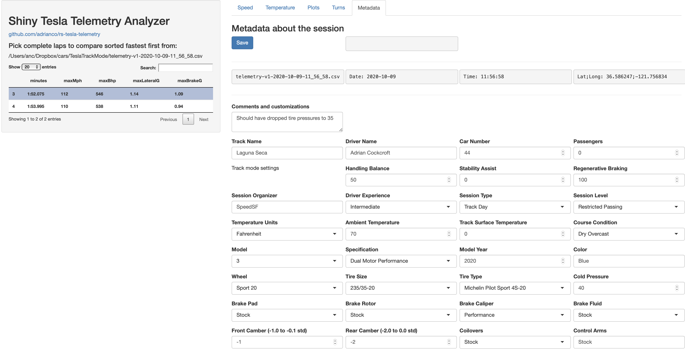

# rs-tesla-telemetry
RStudio Shiny viewer for Tesla Telemetry Track Mode files - personal spare time project.

Files are saved to the USB data logger port that is also used for Sentry videos. There's a silent video file of the track mode session, and a CSV format file named telemetry-v1-date-time.csv, there are 29 columns of data.

Running the app, the telemetry file needs to be on the same machine, specified on the command line or from a chooser popup when run from RStudio. After the file is read it starts the user interface. This removes incomplete laps, sorts by fastest lap time, shows a summary of the performance data lap by lap, and summary tabs with a map view of the selected laps, and comparison plots of selected metrics vs. distance (rather than time, to align better). Plots can be zoomed in and out. Metadata about the session can be entered, and can be saved to a metadata file named and located the same as the telemetry file, which is loaded if it exists at startup. For each track, turn locations can be specified, for now this was manually created for Laguna Seca.

To run the app from the command line without RStudio give the track file path like this:
```
% Rscript app.R /Users/anc/Dropbox/cars/TeslaTrackMode/telemetry-v1-2020-10-09-11_56_58.csv

Attaching package: ‘DT’

The following objects are masked from ‘package:shiny’:

    dataTableOutput, renderDataTable

collapse 1.4.0, see ?`collapse-package` or ?`collapse-documentation`
Note: stats::D  ->  D.expression, D.call, D.name

Attaching package: ‘collapse’

The following object is masked from ‘package:stats’:

    D


Listening on http://127.0.0.1:6344
```
Then navigate to the URL and port shown on your machine using a web browser. Use ^C to stop the Rscript server.
If anything goes wrong, a log of the execution is written to app.Rout.

On MacOS, you can use `$ zsh runme.sh /Users/anc/Dropbox/cars/TeslaTrackMode/telemetry-v1-2020-10-09-11_56_58.csv` which will open the browser for you.

See the [wiki for documentation](https://github.com/adrianco/rs-tesla-telemetry/wiki/Documentation) on how the code works and how to modify and extend it. 
 
 
 
 
 
 
 
 
 
 
 
 
 
